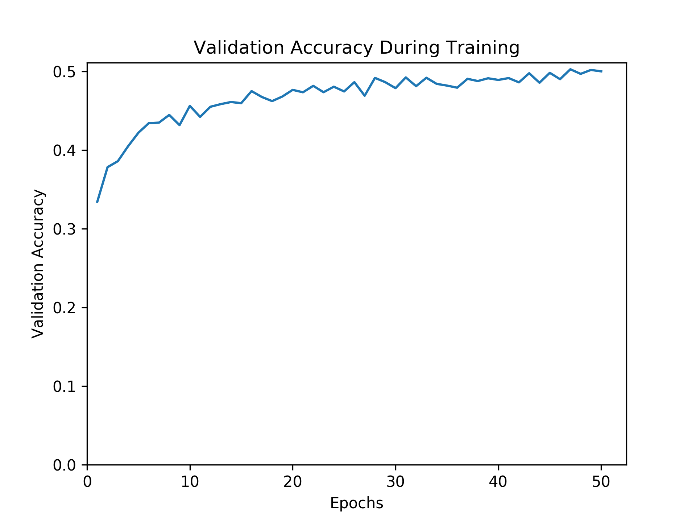
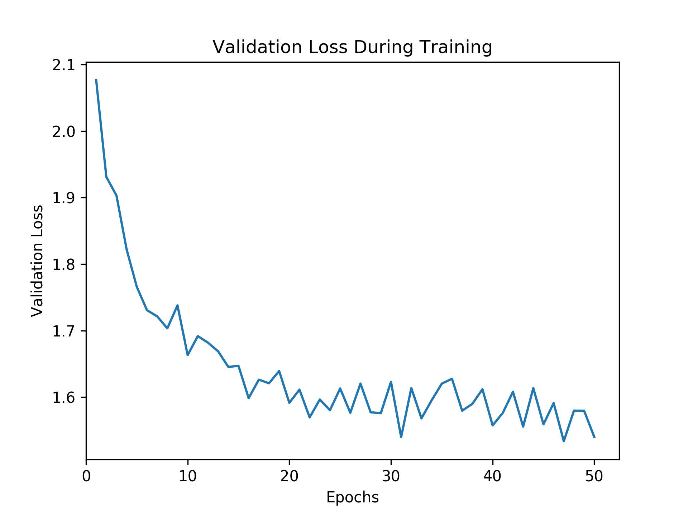

# Artistic Style Recognition
Attempts to guess a painting's artistic style using a deep neural network.
Uses transfer learning on an optimized convolutional SqueezeNet applied to data (not included) from the WikiArt database.

Built for a Machine Learning course at Oxford University.

### TODO:
- Add ability to use multiple architectures, not just SqueezeNet
- Add CUDNN benchmarking
- Add ability to properly disable CUDA (try import?)
